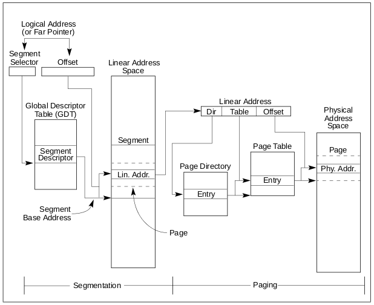

Experiments with IA-32e (x86-64) segmentation and paging on Linux
=================================================================

This respository contains programs used to better understand segmentation and
paging by putting into practice what is explained in Intel's manuals.

Segmentation and paging overview
--------------------------------

Here are some explanations extracted from Intel's manuals.

Segmentation provides a mechanism of isolating individual code, data, and stack
modules so that multiple programs (or tasks) can run on the same processor
without interfering with one another.

Paging provides a mechanism for implementing a conventional demand-paged,
virtual-memory system where sections of a program’s execution environment are
mapped into physical memory as needed. Paging can also be used to provide
isolation between multiple tasks.

When operating in protected mode, some form of segmentation must be used. There
is no mode bit to disable segmentation. The use of paging, however, is optional.

