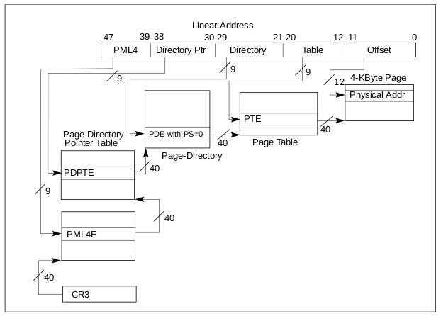

Paging
======

The `paging` kernel module walks through the paging structures, starting from a
linear address and ending to a physical address.

Initialization
--------------

1. The module checks that IA-32e paging is enabled: "A logical processor uses
   IA-32e paging if CR0.PG = 1, CR4.PAE = 1, and IA32_EFER.LME = 1".

2. The module registers the `/dev/paging` misc device.

Walk-through
------------

When a linear address is written to `/dev/paging`:

1. The module reads from the CR3 register [1]_ the physical address [2]_ of the
   first level page structure (PML4).

2. The module splits the provied linear address into offsets to be used as
   indexes at each page structure level.

3. The module walks trough the page structures until the corresponding
   physical address. For educational purposes, the kernel structures are
   not used. Page structures are manually parsed.

4. Finally, the module prints the content located at the physical address.

.. [1] Physical addresses are mapped by the Linux kernel. The mapping starts
       from PAGE_OFFSET. Without KASLR, PAGE_OFFSET equals ffff880000000000.
       See Documentation/x86/x86_64/mm.txt.

.. [2] Page structures are specific to each tasks. Which means the CR3 values
       and page structures are different from one task to another.
