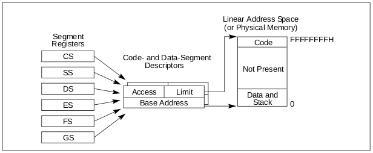
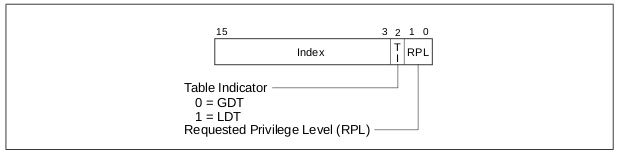
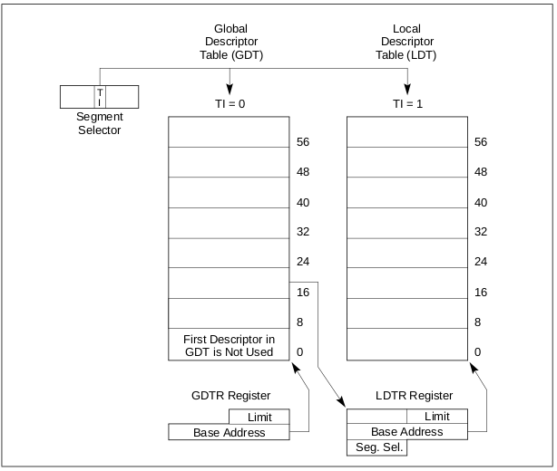
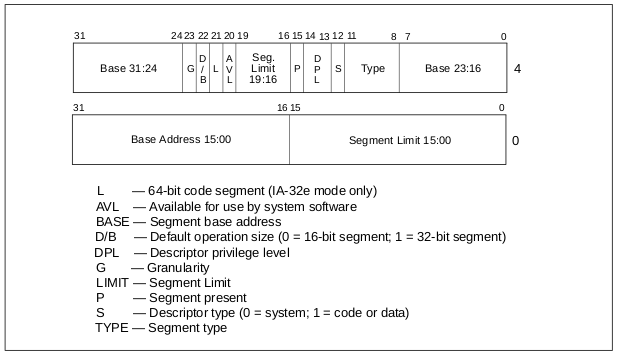
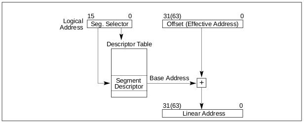

Segmentation
============

This directory contains a kernel module and an userspace program used to
better understand segmentation in IA-32e (x86-64) mode.

Both the kernel module and the userspace program prints:

- the code, stack and data segment selectors from the cs, ss and ds registers
- the Global Descriptor Table base and limit from the GDT register
  (retreived with the sgdt instruction)

In additition, the kernel module is able to print the Global Descriptor Table
entries: the segment descriptors.

How segmentation works
----------------------

Here are some explanations extracted from Intel's manuals.

A logical address consists of a segment selector and an offset.

In 64-bit mode, segmentation is generally (but not completely) disabled,
creating a flat 64-bit linear-address space. The processor treats the segment
base of CS, DS, ES, SS as zero, creating a linear address that is equal to
the effective address.

Segmentation Basic Flat Model:

The segment selector is a unique identifier for a segment.

Among other things it provides an offset into a descriptor table
(such as the global descriptor table, GDT) to a data structure called a
segment descriptor.

The GDT is not a segment itself; instead, it is a data structure in linear
address space. The base linear address and limit of the GDT must be loaded into
the GDTR register

Each segment has a segment descriptor, which specifies the size of the segment,
the access rights and privilege level for the segment, the segment type, and the
location of the first byte of the segment in the linear address space (called
the base address of the segment).

The offset part of the logical address is added to the base address for the
segment to locate a byte within the segment. The base address plus the offset
thus forms a linear address in the processor's linear address space.

